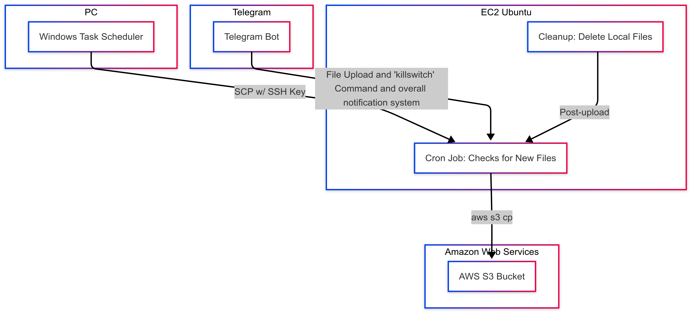
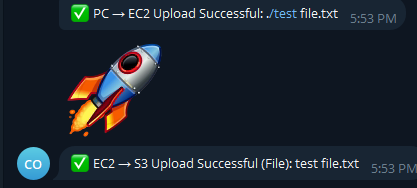
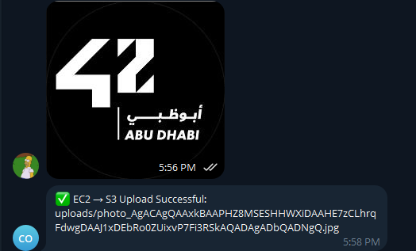

# AWS Secure File Transfer Pipeline

**Author**: Wahab  
**Date**: 2025  
**Purpose**: Demonstrate a secure and automated file transfer system using AWS (EC2, S3), Telegram Bot, and Windows Task Scheduler.

---

## Table of Contents
1. [Introduction](#introduction)  
2. [High-Level Overview](#high-level-overview)  
3. [Key Components](#key-components)  
4. [Architecture Diagram](#architecture-diagram)  
5. [Telegram Bot Demo (Screenshot)](#telegram-bot-demo-screenshot)  
6. [Setup & Configuration](#setup--configuration)  
7. [Flow Explanation & Code Snippets](#flow-explanation--code-snippets)  
8. [Security Considerations](#security-considerations)  
9. [License](#license)  

---

## Introduction
In this project, I built a **secure file transfer pipeline** for my Cyber Security class. The goals:

- Reliably upload files from my **Windows PC** to an **AWS EC2** instance using **SCP**.  
- Automatically sync files from EC2 to **AWS S3**, then remove them from EC2 for minimal exposure.  
- Allow a **Telegram Bot** to receive files or commands and funnel them into the same EC2→S3 pipeline.  
- Include a **“Dead Man Switch”** (/killswitch) to wipe EC2 storage on demand.  

This repository holds:
- Bash/PowerShell scripts for **automation**.  
- Python code for the **Telegram Bot**.  
- Sample **cron** and **Windows Task Scheduler** instructions.  

---

## High-Level Overview

1. **PC → EC2**  
   - Windows Task Scheduler triggers every 1.5 hours, uploading new files via **SCP** with SSH key-based authentication.

2. **Telegram → EC2**  
   - Telegram Bot listens for new files or commands (like `/killswitch`).  
   - Files are saved to EC2’s local storage.

3. **EC2 → S3**  
   - A cron job checks for new files every 2 hours, uses `aws s3 cp` to upload them.  
   - Successful uploads are deleted locally.

4. **Notifications**  
   - Telegram Bot notifies me of successful or failed uploads.

---

## Key Components

- **AWS EC2 (Ubuntu 24.04)**: Main server running Bash/Python scripts.  
- **AWS S3**: Stores all uploaded files.  
- **IAM Role**: Grants EC2 permission to write to S3 without storing AWS keys.  
- **Telegram Bot**: Receives files, issues commands, and sends status updates.  
- **Windows Task Scheduler**: Automates file uploads from PC to EC2.  
- **Cron Jobs**: Automates EC2→S3 uploads and local cleanup.  

---

## Architecture Diagram

Below is a **static image** illustrating the entire pipeline:



**Diagram Explanation**:  
- The **PC** (with Task Scheduler) and **Telegram Bot** both feed files/commands into EC2.  
- EC2’s cron job uploads them to **S3**, then triggers a **Cleanup** script that deletes the local copy.  
- Telegram’s `/killswitch` command triggers an immediate cleanup if needed.

---

## Telegram Bot Demo (Screenshots)

Below are two **example screenshots** showing how the Telegram Bot reports successful uploads:

**pc -> EC2 -> EC3**  


> The bot sends confirmation messages when files successfully upload from PC → EC2 and from EC2 → S3.

**Phone -> EC2 -> S3**  


> Images sent via Telegram are also stored on EC2 and automatically uploaded to S3, with a status message confirming success.

## Setup & Configuration

### 1. AWS Requirements
1. **EC2 Instance** (Ubuntu 24.04 recommended).  
   - Open inbound SSH for your IP only.  
   - Attach an IAM role with `s3:PutObject` (and relevant `s3:ListBucket` or `s3:GetObject` if needed).  

2. **S3 Bucket**  
   - Create a bucket (e.g., `wahab-secure-bucket`).  
   - Ensure bucket policy is configured to only allow the **IAM Role** to upload.

### 2. Telegram Bot
1. Talk to **@BotFather** to create a new bot.  
2. Retrieve your **Bot Token** and store it securely (e.g., environment variable).  

### 3. Windows PC
1. Create a folder for files you want to upload (`C:\my_uploads\`).  
2. Generate an SSH key if you don’t already have one.  
3. Use **Windows Task Scheduler** to run a script (`upload_to_ec2.ps1` or `.bat`) every 1.5 hours.

### 4. EC2 Configuration
1. **Install** `awscli`, `python3`, `pip`, etc.  
   ```bash
   sudo apt-get update
   sudo apt-get install awscli python3 python3-pip -y
   ```
2. **Clone this repo**:
   ```bash
   git clone https://github.com/<youruser>/<this_repo>.git
   ```
3. **Set up cron**:
   - Edit the crontab: `crontab -e`
   - Example entry (run every 2 hours):
     ```
     0 */2 * * * /home/ubuntu/aws_upload.sh >> /home/ubuntu/cron.log 2>&1
     ```

---

## Flow Explanation & Code Snippets

### 1. Windows Task Scheduler Script

```powershell
# File: upload_to_ec2.ps1
# This runs on your Windows PC to SCP files to EC2.

# Variables
$remoteUser = "ubuntu"
$remoteHost = "ec2-XX-XX-XX-XX.compute-1.amazonaws.com"
$sshKeyPath = "C:\path\to\my_key.pem"
$localPath  = "C:\my_uploads\*"
$remotePath = "/home/ubuntu/uploads/"

# The actual SCP command
scp -i $sshKeyPath $localPath "$($remoteUser)@$($remoteHost):$remotePath"
```

### 2. EC2 Script: `aws_upload.sh`

```bash
#!/usr/bin/env bash
# Check for new files in /home/ubuntu/uploads
# Upload them to S3, then remove them locally.

UPLOAD_DIR="/home/ubuntu/uploads"
S3_BUCKET="s3://wahab-secure-bucket"

if [ "$(ls -A $UPLOAD_DIR)" ]; then
    echo "Found new files, uploading to S3..."
    aws s3 cp $UPLOAD_DIR $S3_BUCKET --recursive
    
    if [ $? -eq 0 ]; then
        echo "Upload successful. Removing local files..."
        rm -rf $UPLOAD_DIR/*
    else
        echo "Upload failed. Retaining files for debugging."
    fi
else
    echo "No files to upload."
fi
```

### 3. Telegram Bot Snippet (Python)

```python
import telebot
import os
import subprocess

BOT_TOKEN = os.getenv("TELEGRAM_BOT_TOKEN")
bot = telebot.TeleBot(BOT_TOKEN)

@bot.message_handler(commands=['start'])
def send_welcome(message):
    bot.reply_to(message, "Hello! Send me a file or use /killswitch.")

@bot.message_handler(content_types=['document', 'photo', 'video'])
def handle_incoming_file(message):
    file_id = None

    if message.document:
        file_id = message.document.file_id
    elif message.photo:
        file_id = message.photo[-1].file_id
    elif message.video:
        file_id = message.video.file_id

    # Download file from Telegram
    file_info = bot.get_file(file_id)
    downloaded_file = bot.download_file(file_info.file_path)
    
    # Save the file to EC2 uploads directory
    file_name = file_info.file_path.split('/')[-1]
    with open(f'/home/ubuntu/uploads/{file_name}', 'wb') as new_file:
        new_file.write(downloaded_file)

    bot.reply_to(message, "File received! It will be uploaded to S3 soon.")

@bot.message_handler(commands=['killswitch'])
def killswitch(message):
    # For example, remove all local files:
    try:
        subprocess.run(["rm", "-rf", "/home/ubuntu/uploads/*"], check=True)
        bot.reply_to(message, "All local files have been deleted from EC2.")
    except Exception as e:
        bot.reply_to(message, f"Error running killswitch: {e}")

# Main loop
bot.polling()
```

---

## Security Considerations

1. **SSH Key Authentication**  
   - No passwords allowed. Keep private keys secure and limit IP inbound rules.

2. **IAM Role on EC2**  
   - Ensure the EC2 has an IAM Role that only grants the minimal needed S3 permissions.

3. **Deleting Local Files**  
   - Minimizes exposure if the EC2 instance is ever compromised.

4. **`/killswitch`**  
   - Must confirm you trust the Telegram Bot environment. If your Bot Token is leaked, malicious actors could wipe your EC2.  
   - Consider additional auth checks if needed.

5. **Firewall/Network**  
   - Restrict SSH to your home/work IP.  
   - Use security groups and NACLs in AWS for an extra layer of protection.

---
